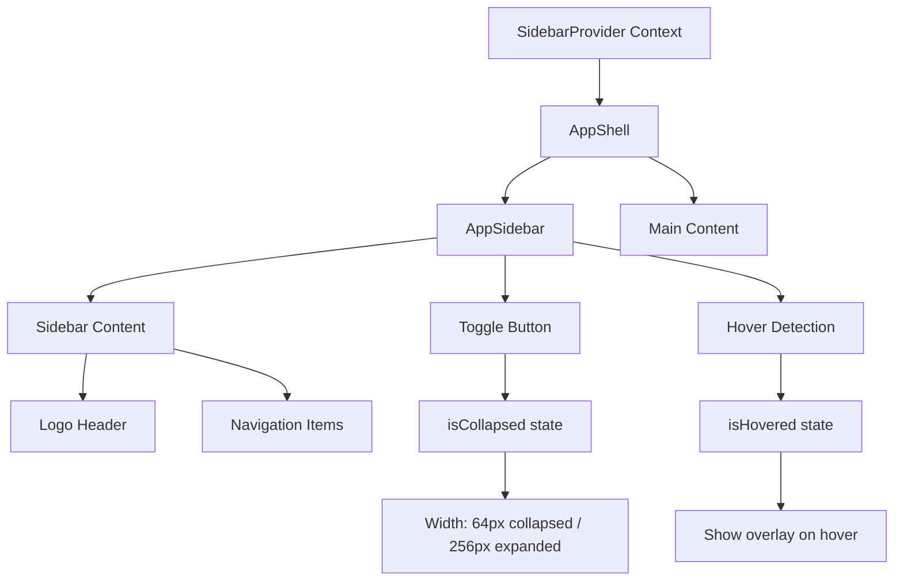

# Kế Hoạch Cải Thiện Sidebar - Toggle Button & Hover to Expand

## 🎯 Mục Tiêu
Nâng cấp sidebar hiện tại để trông chuyên nghiệp hơn với:
1. **Nút Toggle Thông Minh**: Mũi tên (< >) nằm trên đường biên giữa sidebar và nội dung chính
2. **Hover to Expand**: Sidebar tự động mở rộng (overlay) khi hover vào khi đang thu gọn

## 📊 Kiến Trúc Hiện Tại

### Cấu trúc Component
```
App
└── AppShell
    ├── AppSidebar (w-64, fixed width)
    └── Main Content Area
```

### Files Liên Quan
- `src/layouts/shared/AppShell.tsx` - Container chính
- `src/layouts/shared/AppSidebar.tsx` - Component sidebar
- `src/layouts/admin/AdminLayout.tsx` - Layout admin
- `src/layouts/student/StudentLayout.tsx` - Layout student
- `src/layouts/moderator/ModeratorLayout.tsx` - Layout moderator

## 🔄 Kiến Trúc Mới



## 📋 Chi Tiết Kế Hoạch

### 1. Tạo Sidebar Context
**File**: `src/contexts/SidebarContext.tsx` (mới)

**Chức năng**:
- Quản lý state `isCollapsed` (true/false)
- Quản lý state `isHovered` (true/false)
- Cung cấp function `toggleSidebar()`
- Lưu trạng thái vào localStorage để persist

**State Management**:
```typescript
interface SidebarContextType {
  isCollapsed: boolean;
  isHovered: boolean;
  toggleSidebar: () => void;
  setIsHovered: (hovered: boolean) => void;
}
```

### 2. Cập Nhật AppShell
**File**: `src/layouts/shared/AppShell.tsx`

**Thay đổi**:
- Bọc component trong `SidebarProvider`
- Truyền context xuống AppSidebar
- Điều chỉnh layout để hỗ trợ sidebar động

**CSS Classes**:
- Khi collapsed: `w-16` (64px)
- Khi expanded: `w-64` (256px)
- Transition smooth: `transition-all duration-300 ease-in-out`

### 3. Cập Nhật AppSidebar
**File**: `src/layouts/shared/AppSidebar.tsx`

**Tính năng mới**:

#### A. Toggle Button
- **Vị trí**: Absolute positioned trên đường biên phải của sidebar
- **Icon**: ChevronLeft khi mở, ChevronRight khi đóng (từ lucide-react)
- **Style**: 
  - Background: white với shadow
  - Border radius: rounded-full
  - Size: 24x24px
  - Position: `absolute right-0 top-20 translate-x-1/2`
  - Z-index cao để luôn ở trên
  
#### B. Hover to Expand
- **Trigger**: `onMouseEnter` và `onMouseLeave` events
- **Behavior**: 
  - Chỉ hoạt động khi `isCollapsed === true`
  - Khi hover: sidebar nở ra với `position: fixed` và `z-index: 50`
  - Hiển thị overlay shadow để làm nổi bật
  - Khi rời chuột: thu gọn lại sau 200ms delay

#### C. Nội Dung Động
- **Khi collapsed**:
  - Ẩn text labels
  - Chỉ hiển thị icons
  - Logo header chỉ hiển thị icon
  - Subtitle ẩn
  
- **Khi expanded/hovered**:
  - Hiển thị đầy đủ text
  - Logo + subtitle
  - Navigation labels

### 4. CSS Transitions & Animations

**Animations cần implement**:
```css
/* Sidebar width transition */
transition: width 300ms cubic-bezier(0.4, 0, 0.2, 1);

/* Content fade in/out */
transition: opacity 200ms ease-in-out;

/* Toggle button rotation */
transition: transform 200ms ease-in-out;

/* Hover overlay effect */
box-shadow: 0 20px 30px rgba(0, 0, 0, 0.15);
```

### 5. Responsive Design

**Mobile (< 768px)**:
- Sidebar luôn ẩn theo default
- Hiển thị hamburger menu button
- Sidebar xuất hiện dạng overlay khi mở
- Toggle button ẩn trên mobile

**Tablet & Desktop (>= 768px)**:
- Hiển thị toggle button
- Hỗ trợ đầy đủ tính năng collapse/expand
- Hover to expand chỉ trên desktop

### 6. Local Storage Persistence

**Key**: `exambank-sidebar-collapsed`
**Value**: `"true"` hoặc `"false"`

Lưu mỗi khi user toggle, restore khi load lại trang.

## 🎨 Design Specifications

### Toggle Button
```
Size: 24x24px
Background: #ffffff
Border: 1px solid var(--line-soft)
Shadow: 0 2px 8px rgba(0,0,0,0.1)
Icon Size: 14px
Icon Color: var(--ink-700)
Hover: scale(1.1) + shadow tăng
```

### Collapsed Sidebar
```
Width: 64px (w-16)
Padding: p-2
Icons: 20x20px
Icon Color: var(--ink-700)
Active Icon: var(--brand-700)
```

### Expanded Sidebar (Hover)
```
Width: 256px (w-64)
Position: fixed
Z-index: 50
Shadow: 0 20px 30px rgba(0,0,0,0.15)
Background: #f2f5fa với backdrop-blur
```

### Navigation Items (Collapsed)
```
Chỉ icon, không text
Centered
Padding: p-3
Tooltip (optional): Hiển thị label khi hover vào icon
```

## 🔧 Implementation Order

1. **Phase 1: Context Setup**
   - Tạo SidebarContext
   - Integrate vào App.tsx
   - Test state management

2. **Phase 2: Basic Toggle**
   - Thêm toggle button
   - Implement collapse/expand logic
   - CSS transitions

3. **Phase 3: Hover Feature**
   - Implement hover detection
   - Overlay rendering
   - Hover delay logic

4. **Phase 4: Content Adaptation**
   - Điều chỉnh logo header
   - Điều chỉnh navigation items
   - Fade in/out animations

5. **Phase 5: Polish**
   - Responsive breakpoints
   - LocalStorage persistence
   - Cross-browser testing

6. **Phase 6: Integration**
   - Test với AdminLayout
   - Test với StudentLayout
   - Test với ModeratorLayout

## 📦 Dependencies

**Cần cài thêm**: Không - sử dụng dependencies hiện có
- React hooks (useState, useEffect, useContext)
- lucide-react (ChevronLeft, ChevronRight icons)
- Tailwind CSS (có sẵn)

## ⚠️ Lưu Ý

1. **Accessibility**: 
   - Toggle button cần có aria-label
   - Keyboard navigation (Space/Enter to toggle)
   - Focus visible states

2. **Performance**:
   - Debounce hover events
   - Use CSS transforms thay vì width khi có thể
   - Optimize re-renders với React.memo nếu cần

3. **UX Considerations**:
   - Delay 200ms trước khi collapse sau khi unhover
   - Animation không quá nhanh (300ms optimal)
   - Visual feedback rõ ràng

## ✅ Testing Checklist

- [ ] Toggle button hoạt động đúng
- [ ] Hover expand/collapse mượt mà
- [ ] State persist qua page reload
- [ ] Responsive trên mobile
- [ ] Hoạt động đúng trên tất cả layouts
- [ ] Icons hiển thị đúng trong collapsed mode
- [ ] Text labels fade in/out smooth
- [ ] Keyboard accessibility
- [ ] Cross-browser compatibility

## 📝 Notes

- Thiết kế này theo chuẩn modern UI/UX patterns
- Tham khảo từ: Discord sidebar, VS Code sidebar, Notion sidebar
- Ưu tiên user experience và performance
- Code cần clean, maintainable, và well-documented
